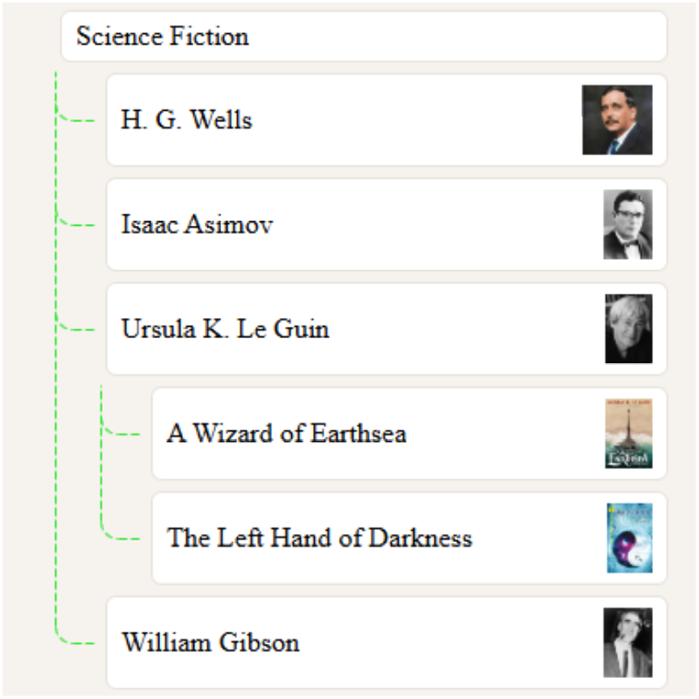
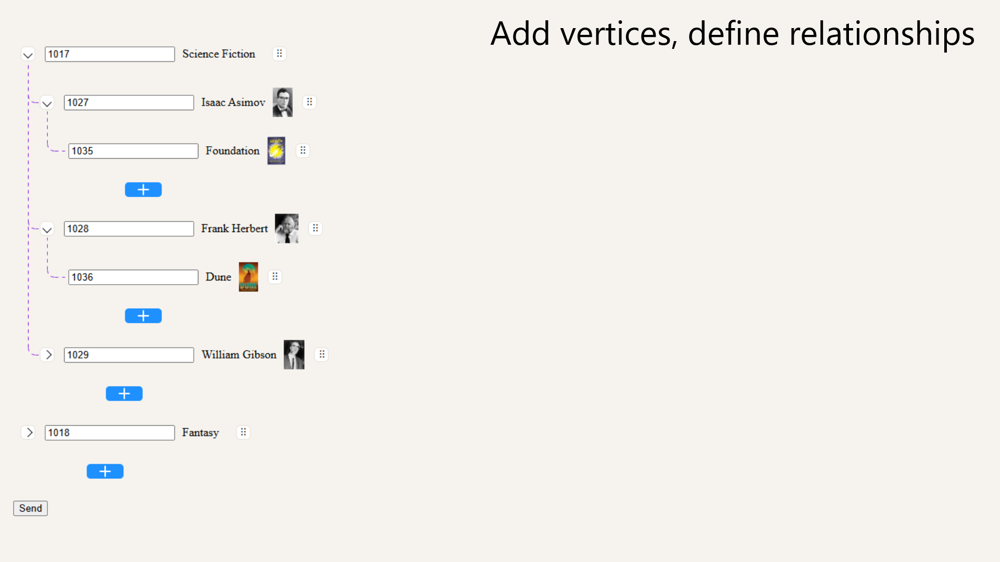
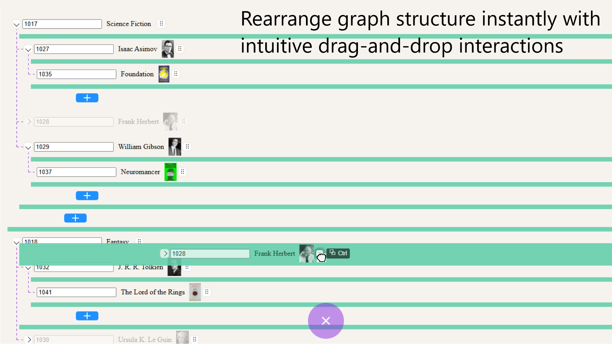
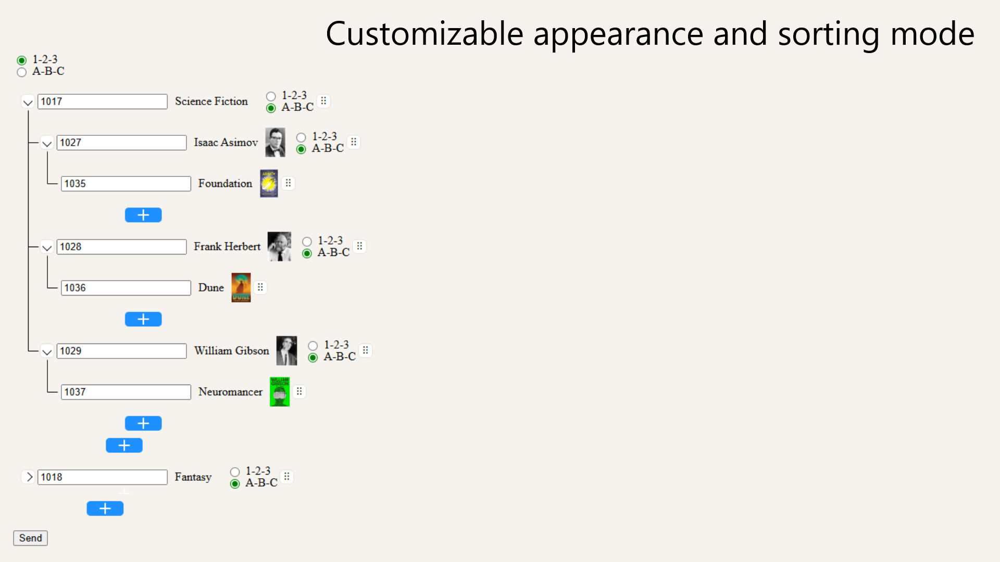
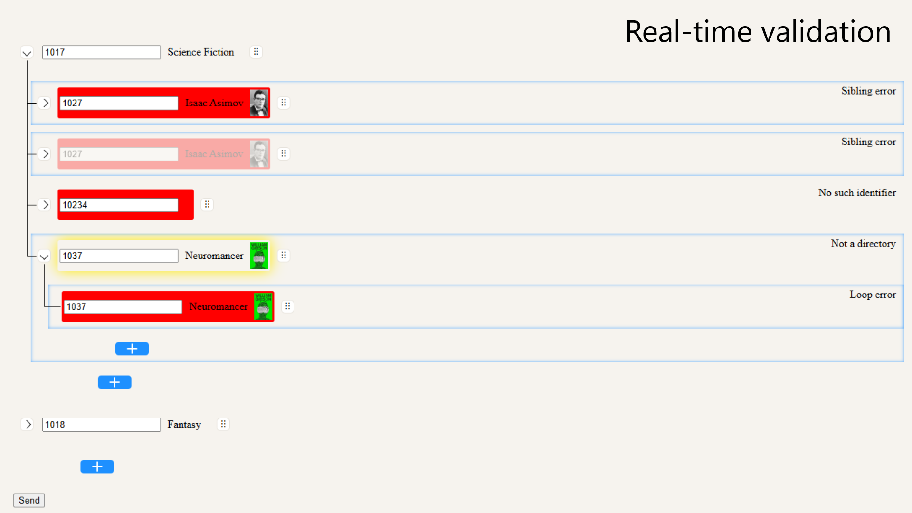

# 🧠 Hierarchical Structure Builder

A lightweight JavaScript library for creating, previewing, and validating hierarchical data structures before submitting them to a database, API, or any custom backend.

It is suitable for product catalogs, organizational charts, document trees, category systems, and other nested data structures.

---
## Preview







---

## Purchase

The complete package, including source files, examples, and documentation, is available on Gumroad.

👉 https://alexeeff.gumroad.com/l/nhkcmc

---

## 🚀 Features

- Visual builder for hierarchical data structures
- Profile (read-only) and Create modes
- Automatic hierarchy rendering
- Real-time preview of generated structure
- Validation before sending data to backend
- Works with APIs, databases, and custom systems
- AJAX-friendly callbacks
- Customizable templates
- No dependencies (Vanilla JavaScript)
- Lightweight and easy to integrate
- Flexible and extensible architecture

---

## 📦 Installation

Include the stylesheet and script on your page.

```html
<link rel="stylesheet" href="graph.css">

<script src="graph.js"></script>
```

---

## 🛠 Quick Start

Initialize every graph on the page.

```javascript
document.addEventListener('DOMContentLoaded', () => {
	document.querySelectorAll('.graph').forEach(graphElement => {
		if (graphElement.classList.contains('graph--profile')) {
			new Graph(graphElement);
			
		} else if (graphElement.classList.contains('graph--create')) {
			new CreateGraph(graphElement);
			
		}
	});
});
```

---

## 📄 Graph Modes

The library provides two graph types.

Graph

Displays an existing hierarchy.

The backend should generate HTML similar to (creates a flat list of elements inside "graph graph--profile" element):

```php
<div class="graph graph--profile">
	
    <div class="graph__vertex"
        data-parent=""
        data-id="15"
        data-sorting="alphabet"
        data-node-type="leaf">
    </div>

	<div class="graph__vertex"
       ...
    </div>
	
	...
	
</div>
```

CreateGraph

Allows users to build a hierarchy.

The backend should generate HTML similar to (similar to Graph, but the list is created from the post or get array):

```php
<div class="graph graph--create">
	
    <div class="graph__vertex"
        data-parent=""
        data-id=""
        data-number=""
        data-sorting="">
    </div>

	<div class="graph__vertex"
       ...
    </div>
	
	...

</div>
```

During the initial page load the library automatically creates all required controls.

---

## 📌 Data Attributes

graph__vertex

|Attribute			| Required			| Description 													|
|-------------------|-------------------|---------------------------------------------------------------|
|data-id			| ✅				| Unique vertex identifier. 									|
|data-parent		| ✅				| Parent identifier. Root vertices use an empty string (""). 	|
|data-sorting		| optional			| Sorting method (number or alphabet). 							|
|data-number		| CreateGraph only	| Display order. 												|
|data-node-type		| Profile only		| Vertex state. 												|

---

## 🌳 Node Types

The following values are supported for data-node-type.

Value		Description
leaf		Final node. Cannot contain children.
error		The referenced entity does not exist in the database.

Examples of leaf:
```text
product inside a category
employee in a department
file inside a folder
book owned by an author
```

---

## 📋 Generated Form Fields

The library generates standard HTML form fields and does not require multipart/form-data.
The library generates the following input names automatically during form creation:

```text
rootSorting
id[]
parent[]
sorting[]
number[]
```

---

## ⚠ Requirements

```text
data-id is required.
Root vertices must use data-parent="".
One hierarchy must exist inside one `<form>`.
Multiple forms cannot be used for the same hierarchy.
Sorting must always be performed on the server.
The library prevents cyclic relations (A → B, B → A) and (A → B → A). Cyclic relations (A → B → A) when constructing an existing graph must be prevented in the database query.
```

---

## 💡 Notes

The default blue highlighting shown while editing is not an error.

It simply indicates that identical node IDs currently contain different data.

After editing, the nodes become synchronized automatically.

---

## 🔄 Rebuilding After Validation Errors

If the page is reloaded after a failed database insertion, the graph is rebuilt from the existing data-* attributes.

If identical nodes exist in multiple places within the hierarchy, duplicate database inserts may occur.

It is recommended to ignore duplicate-key errors during insertion.

Example:

```php
mysqli_execute_query($link, $query, 	[	
											$assortment_id,
											0,
											0,
											$_POST['rootSorting'],
											1
										]);

foreach ($_POST['id'] as $index => $value) {
	try {
		mysqli_execute_query($link, $query,     [	
													$assortment_id,
													$_POST['id'][$index],
													$_POST['parent'][$index],
													$_POST['sorting'][$index],
													$_POST['number'][$index]
												]);
	}
	catch (mysqli_sql_exception $e) {
		if ($e->getCode() === 1062) {
			continue;
		} else {
			throw $e;
		}
	}
}
```

---

## 🎨 Rendering

Connection lines begin rendering automatically after graph creation.

Rendering can be controlled globally.

```javascript
Graph.stopRendering();

Graph.startRendering();
```

---

## 📚 Public API

Every graph instance exposes the following public properties and methods.

### Properties

| Property 		| Type 				| Description												|
|---------------|-------------------|-----------------------------------------------------------|
| `element` 	| `HTMLElement` 	| Root graph element. 										|
| `hasError` 	| `boolean` 		| Indicates whether the graph contains validation errors. 	|

### Methods

| Method | Description	|
|--------|--------------|
| `revealErrors()` 		| Expands all branches containing validation errors. |

---

## 🧠 Customization

The library allows you to customize both the appearance of the graph and the templates used to create or display vertices.

- **Graph Profile** – customize the appearance of an existing graph.
- **Create Graph** – replace the default templates used when creating a graph.
- **Constructor Options** – configure library behavior.
- **Callbacks** – integrate with your backend or custom logic.

---

## 🎨 Graph Profile

### Custom vertex content

If no custom elements are provided, the library generates the vertex content and sorting indicator from the corresponding `data-*` attributes.

If both a `data-*` attribute and a custom element are present, **the custom element takes precedence**. If there is a custom element, the data attribute associated with it is not needed.

### Root sorting element

Add a custom root sorting element with the class `graph__sorting` directly inside the graph root.

```html
<div class="graph graph--profile">
    <span class="graph__sorting">
        ...
    </span>

    ...
</div>
```

### Vertex content

Add a custom `graph__content` element inside every vertex.

```html
<div class="graph__vertex" ...>

    <div class="graph__content">

        ...

        <span class="graph__sorting">
            ...
        </span>
		
		...
		
    </div>

	...
	
</div>
```

> **Note**
>
> The custom sorting element **must**
>
> - be inside `.graph__content`
> - have the class `.graph__sorting`

---

## 🏗 Create Graph

The default templates used by `CreateGraph` can be replaced with custom ones.

### Root templates

The following templates should be placed directly inside the graph root:

- `graph__sorting`
- `graph__trash-can`
- `graph__content`

Example:

```html
<div class="graph graph--create">

    <div class="graph__trash-can">
        ...
    </div>

    <div class="graph__sorting">
        ...
    </div>

    <div class="graph__content">

        ...

        <div class="graph__sorting">
            ...
        </div>
		
		...
		
    </div>

	...
	
</div>
```

### Required structure

If a template is invalid, it will automatically be replaced with the default one.

Requirements:

- `graph__id-input` is **required**
- `graph__id-input` must be inside `graph__content`
- `graph__id-input` must be of type "text" or "number"
- nesting depth does not matter
- every `graph__sorting` must contain **exactly two** `.graph__sorting-input` elements
- input values must be:
    - `number`
    - `alphabet`
- input types and other attributes are optional

---

## ⚙ Constructor Options

Both constructors accept an options object.

```javascript
const graph = new Graph(element, options);

const createGraph = new CreateGraph(element, options);
```

A complete configuration example:

```javascript
document.addEventListener('DOMContentLoaded', () => {
    const graphElements = document.querySelectorAll('.graph');
    
    graphElements.forEach(graphElement => {
        if (graphElement.classList.contains('graph--profile')) {
            const options = {
                publicMode: true               	,
                showConnections: true           ,
                ignoreSorting: false            ,
                ignoreRootSorting: false        ,
                setLineDash: [5, 5]             ,
                lineWidth: 1                    ,
                strokeStyle: '#2be22b'        	,
                arcRadius: 10                   ,
                contentClickCallback
           
            };
            
            const graph = new Graph(graphElement, options);
            
        } else if (graphElement.classList.contains('graph--create')) {
            const options = {
                nestingDepth: 10                ,
                defaultSorting: 'alphabet'      ,
                defaultRootSorting: 'number'    ,
                showConnections: true           ,
                ignoreSorting: false            ,
                ignoreRootSorting: false        ,
                scrollAreaWidth: 50             ,
                scrollAreaHeight: 50            ,
                scrollSpeedWidth: 20            ,
                scrollSpeedHeight: 20           ,
                setLineDash: [5, 2]             ,
                lineWidth: 1                    ,
                strokeStyle: 'black'            ,
                arcRadius: 10                   ,
                validateVertexCallback          ,
                onValidateResult
            };
            
            const graph = new CreateGraph(graphElement, options);
            
        }
    });
});
...
```

---

## 📋 Available Options

### Graph

| Option 					| Type 		| Default 	| Description 										|
|---------------------------|-----------|-----------|---------------------------------------------------|
| publicMode 				| boolean 	| `false` 	| Enables public display mode. 						|
| showConnections 			| boolean 	| `true` 	| Displays connection lines. 						|
| ignoreSorting 			| boolean 	| `false` 	| Hides and excludes vertex sorting. 				|
| ignoreRootSorting 		| boolean 	| `false` 	| Hides and excludes root sorting. 					|
| setLineDash 				| number[] 	| `[5,5]` 	| Dash pattern for connection lines. 				|
| lineWidth 				| number 	| `1` 		| Connection line width. 							|
| strokeStyle 				| string 	| `#8a2be2` | Connection line color. 							|
| arcRadius 				| number 	| `10` 		| Corner radius of connection lines. 				|
| contentClickCallback 		| function 	| `null` 	| Called when a vertex is clicked. 					|

### CreateGraph

| Option 					| Type 		| Default 	| Description 										|
|---------------------------|-----------|-----------|---------------------------------------------------|
| nestingDepth 				| number 	| `10` 		| Maximum nesting depth. 							|
| defaultSorting 			| string 	| `''` 		| Default vertex sorting (`number` or `alphabet`). 	|
| defaultRootSorting 		| string 	| `''` 		| Default root sorting. 							|
| validateVertexCallback 	| function 	| `null` 	| Validates entered IDs. 							|
| onValidateResult 			| function 	| `null` 	| Receives validation results. 						|
| scrollAreaWidth 			| number 	| `50` 		| Horizontal auto-scroll activation area. 			|
| scrollAreaHeight 			| number 	| `50` 		| Vertical auto-scroll activation area. 			|
| scrollSpeedWidth 			| number 	| `20` 		| Horizontal auto-scroll speed. 					|
| scrollSpeedHeight 		| number 	| `20` 		| Vertical auto-scroll speed. 						|

---

## 🔌 Callbacks

### contentClickCallback(id)

Called when the user clicks `.graph__content`.

Useful for:

- opening a profile
- loading data via AJAX
- navigating to another page

Receives the vertex identifier.

---

### validateVertexCallback(id)

Called whenever:

- an ID changes
- a graph is rebuilt after validation errors

Should return either

```javascript
'ignore'
```

or

```javascript
{
    nodeType: 'leaf' | 'error',
    ...
}
```

The `nodeType` property is reserved by the library.

Any additional fields may contain arbitrary user data.

---

### onValidateResult(contentElement, result)

Called after `validateVertexCallback()`.

Parameters:

- `contentElement` — corresponding `.graph__content` element
- `result` — object returned by `validateVertexCallback`

Typical usage:

- display a title
- display an image
- populate custom fields
- update additional UI

Working examples are included in the examples directory.
